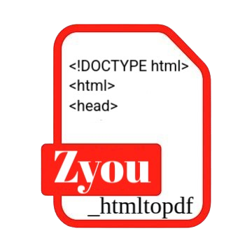

# Zyou_htmltopdf

  

<h1 align="center">👨‍💻 Zyou_htmltopdf 📄</h1>

  
  
  
  
  

  <strong>Une bibliothèque Rust pour convertir vos fichiers HTML en PDF avec simplicité !</strong>.

---
<h1 align="center">⚠️ en Développement ⚠️</h1>

---

### Annexes

- [Installation](#installation)
- [Utilisation](#utilisation)
- [Configurations supportés](#configurations-supportés)
- [Configuration](#configuration)
- [Licence](#licence)
- [Contributeurs](#contributeurs)

---

## Fonctionnalités

## Installation

## Utilisation

## Configurations supportés

## Configuration

## Licence

## Contributeurs
